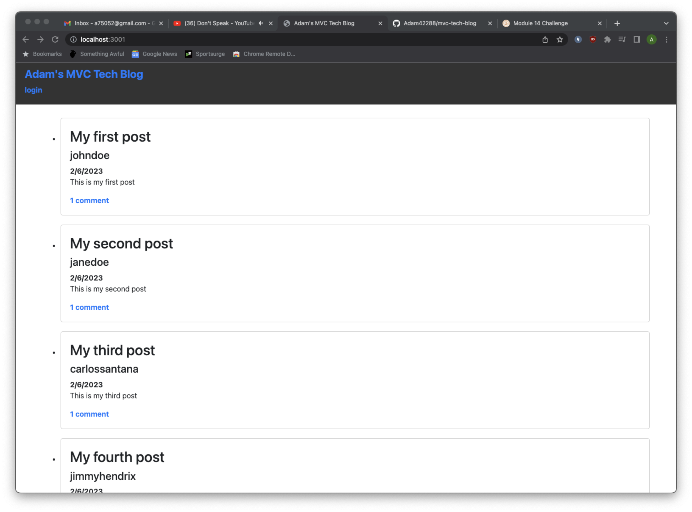

# MVC Tech Blog Challenge  

## Description
This project utilizes the MVC framework to create a tech blog where users can create accounts ,make posts, and comment on other posts
## Table of Contents:
* [Installation](#installation)
* [Usage](#usage)
* [License](#license)
* [Contributing](#contributing)
* [Tests](#tests)
* [Questions](#questions)

### Screenshots

### Installation:
This project uses the following dependencies:
```1. Clone the repo, 2. run SOURCE schema.sql, 3. run use techblog_db, 4. run npm i 5. run npm start 6. open localhost```
### Usage:
N/A
### License:
This project is licensed under:
MIT License
### Contributing:
N/A
### Tests:
In order to test open the console and run the following:
```N/A```
### Questions:
If you have any questions contact me on [GitHub](https://github.com/adam42288) or email 
me at A75052@gmail.com  
 